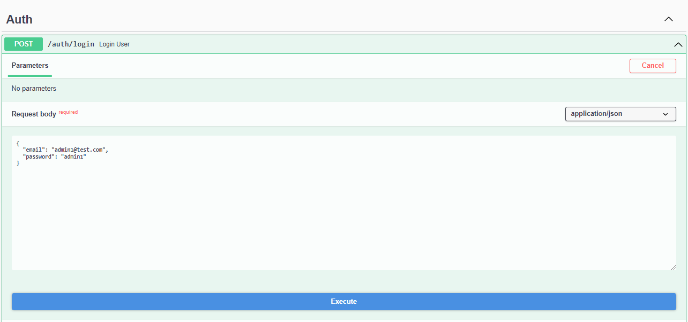
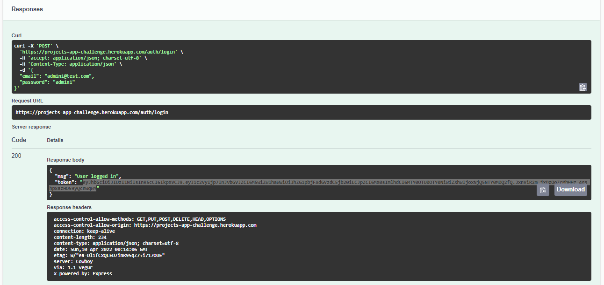
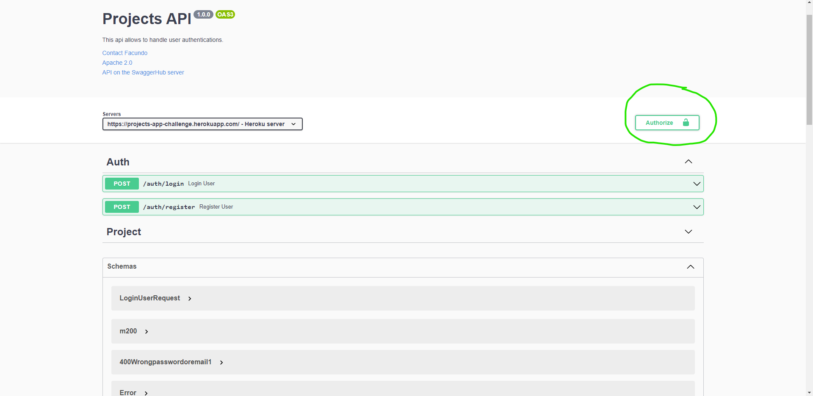

# API Proyectos

1) Ingresar a https://projects-app-challenge.herokuapp.com/api/docs/#/Project

2) Iniciar sesion como usuario admin

3) Copiar Token

4) Pegar Token y click en authorize

Ya  estas autorizado a hacer las peticiones de los endpoints de proyectos
